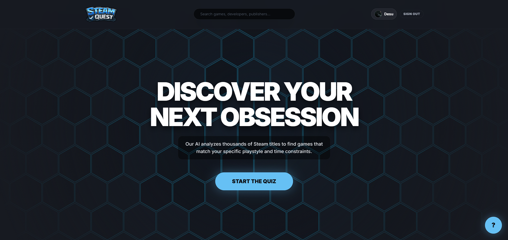
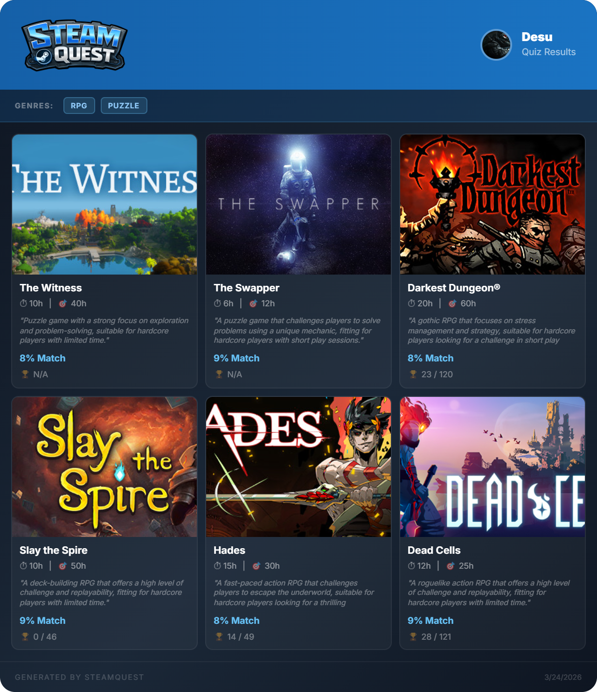
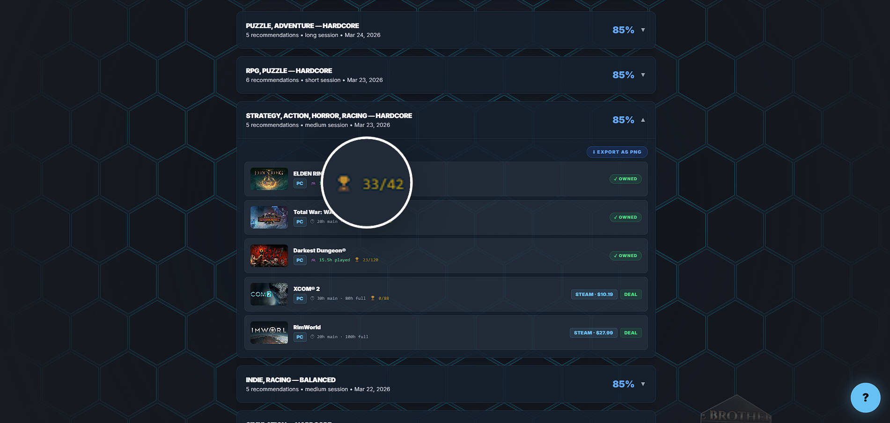

> **Next-gen AI-powered Steam game discovery platform**

---

## Table of Contents
- [Overview](#overview)
- [Features](#features)
- [Screenshots & Demos](#screenshots--demos)
- [How It Works](#how-it-works)
- [Technical Architecture](#technical-architecture)
- [Setup & Running Locally](#setup--running-locally)
- [Deployment](#deployment)
- [Database Schemas](#database-schemas)
- [Credits & Acknowledgements](#credits--acknowledgements)
- [License](#license)

---

## Overview
SteamQuest is an intelligent game discovery platform that helps users explore and find their next favorite Steam game. By combining a smart interactive quiz with a Groq LLM-powered recommendation engine, universal search backed by the RAWG database, real-time Steam stats and personalization, and a rich, modern UI, SteamQuest aims to be the ultimate discovery engine for gamers.

  
*Landing Page*

---

## Features

### 🧠 AI Quiz-based Recommendations
- Personalized game suggestions using a dynamic multi-step quiz covering genre, playstyle, time, keywords, and difficulty.
- Exclude games you already own (requires Steam login).
- Results include playtime estimates, match percentage, Steam/Deal links, and reasoning via Groq LLM.

### 🔍 Universal Cross-Platform Game Search
- Find any PC or console title with fuzzy/keyword search.
- Filter by genre, difficulty, developer, publisher, etc.
- Results include real/estimated price (Steam/GG.deals), platform icons, and full imagery.

### ❤️ Smart Favorites & Exportable Cards
- Save favorites from search or quiz results to your profile.
- Export your quiz or wishlist as a compact PNG card (for sharing!) with genre and platform highlights.
- Example:  
  


### 👤 Deep Steam Integration
- **Login with Steam** (OpenID) for full personalization.
- Profile page shows:
  - Game library stats: total games, played/unplayed split, total/average playtime, Valve XP/Level, account country/age.
  - Recently played (this week) & top played (all time).
- Quiz/History and Wishlist tabs show **already owned** games via automatic badge.

### 🏆 Playtime & Achievement Tracking
- Displays your playtime and achievement progress for nearly all games.
- Real data fetched live from Steam APIs when possible, with fallback to averages if private.
- Example:  
  

### 🖼️ Modern UI & Visuals
- Responsive design using React 19 & Tailwind CSS.
- Card/grid layout, hoverable animated game screens, dark theme, hex background, smooth transitions.
- Interactive feature tours with GIF demos:

---

## How It Works

- **User Flow:**  
  1. Login with Steam (optional).
  2. Take the personalized quiz, or use raw search.
  3. Review recommendations with match % and buy links.
  4. Save favorites, check owned status, export results as PNG.
  5. Explore your Steam stats, playtime, and achievements via your profile.

- **AI Recommendation Pipeline:**  
  - Answers hash → Supabase cache lookup → If not found: prompt Groq Llama-3, validate all results with Steam API (AppID/title matching), enrich with up-to-date deals and images from Steam & RAWG, filter owned, cache for instant repeat loads.

- **Steam Data:**  
  - Uses secure OpenID for auth; stats and playtime require public profiles. No third-party key sharing.

- **PNG Card Export:**  
  - Built with [html-to-image](https://github.com/bubkoo/html-to-image); exports 3-column visually detailed images of your quiz/wishlist for easy sharing.

---

## Technical Architecture

**Frontend**
- React 19 (with functional hooks + modern state management)
- TypeScript for strict typing
- Tailwind CSS for all styling
- Vite for quick dev/build

**Backend/APIs**
- Vercel serverless API routes:
    - `/api/auth/steam` (login), `/api/auth/me`, `/api/auth/logout`
    - `/api/steam-library`, `/api/steam-playtime`, `/api/steam-stats`, `/api/steam-appdetails`
- Groq LLM API (powers quiz recommendations)
- RAWG API (universal game database)
- GG.deals API (best PC game pricing, optional)
- Supabase (database for profiles, quiz cache, favorites, stats)

**Database**
- Quiz results, user data, Steam stats are all cached in Supabase tables with efficient keying & index for low latency.

#### Key Packages
- `@supabase/supabase-js` (profiles, stats, quiz results)
- `react`, `react-dom`, `tailwindcss`
- `html-to-image`
- `shepherd.js` (interactive feature tours)
- [See `package.json`](./package.json) for full dependency list

---

## Setup & Running Locally

**Prerequisites:** Node.js 18+

1. Install dependencies:
   ```sh
   npm install
   ```
2. Create your environment config:
   - Copy `.env.local.example` to `.env.local` and set:
     ```
     VITE_GROQ_API_KEY=your_groq_key
     VITE_RAWG_API_KEY=your_rawg_key
     # optional: VITE_GGDEALS_API_KEY
     VITE_SUPABASE_URL=your_supabase_url
     VITE_SUPABASE_ANON_KEY=your_supabase_anon_key
     STEAM_API_KEY=your_steam_web_api_key
     AUTH_SECRET=at_least_32_random_chars
     APP_URL=http://localhost:3000
     ```
3. Prepare Supabase tables via:
   ```sql
   CREATE TABLE IF NOT EXISTS quiz_results (...);
   CREATE TABLE IF NOT EXISTS steam_stats_cache (...);
   ```
   _Full schema in [Database Schemas](#database-schemas)._
4. Place `logo.png` in `/public/` and all screenshots/GIFs in `/gifs/`.
5. Start dev server:
   ```sh
   npm run dev
   ```
6. Visit [http://localhost:3000](http://localhost:3000)

> **Steam login note:** Use [ngrok](https://ngrok.com/) or deploy to Vercel for working OpenID callback.

---

## Deployment

- **Vercel recommended.**  
- Set **all** env variables in dashboard.  
- `STEAM_API_KEY` and `AUTH_SECRET` are never exposed to the browser.

---

## Database Schemas

### `quiz_results`
```sql
CREATE TABLE IF NOT EXISTS quiz_results (
  id           uuid        PRIMARY KEY DEFAULT gen_random_uuid(),
  steam_id     text        NOT NULL,
  answers_hash text        NOT NULL,
  answers      jsonb       NOT NULL,
  results      jsonb       NOT NULL,
  created_at   timestamptz DEFAULT now()
);

CREATE UNIQUE INDEX IF NOT EXISTS quiz_results_steam_id_answers_hash
  ON quiz_results (steam_id, answers_hash);
```
### `steam_stats_cache`
```sql
CREATE TABLE IF NOT EXISTS steam_stats_cache (
  steam_id   text        PRIMARY KEY,
  stats      jsonb       NOT NULL,
  updated_at timestamptz DEFAULT now()
);
```

---

## Credits & Acknowledgements

- Game & platform data by [RAWG](https://rawg.io/apidocs)
- PC pricing via [GG.deals](https://gg.deals/)
- AI quiz powered by [Groq LLM API](https://console.groq.com/)
- Steam integration: [Steam Web API](https://partner.steamgames.com/doc/webapi_overview)
- PNG exports: [html-to-image](https://github.com/bubkoo/html-to-image)
- Built with [React](https://react.dev/), [Tailwind CSS](https://tailwindcss.com/), [Vite](https://vitejs.dev/), [Supabase](https://supabase.com/), and [Vercel](https://vercel.com/).

---

## License

[MIT](./LICENSE)

---

> *Developed by [de4su](https://github.com/de4su) — University Project 2026*
